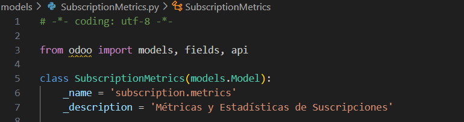
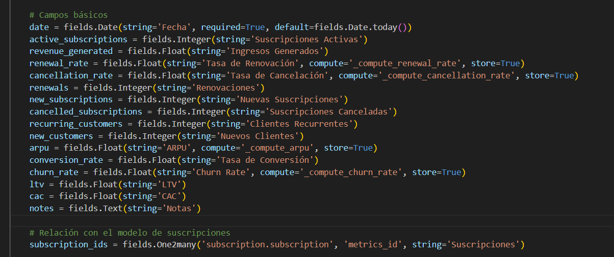
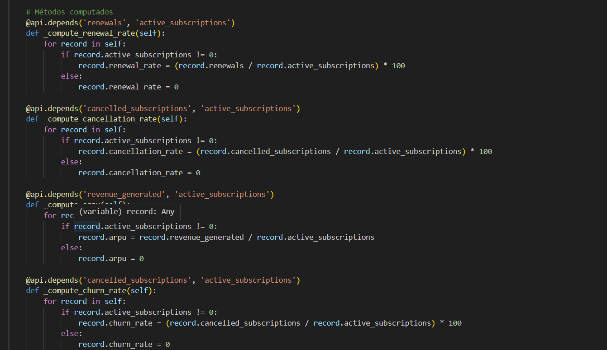
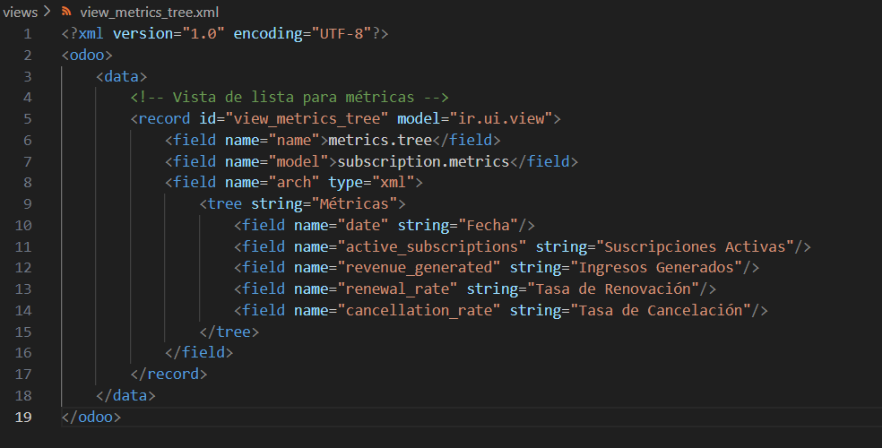
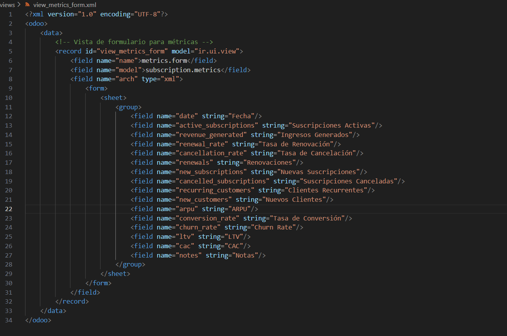
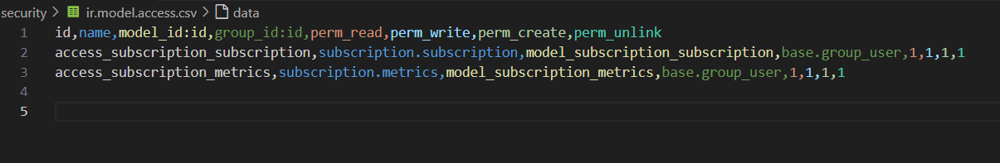
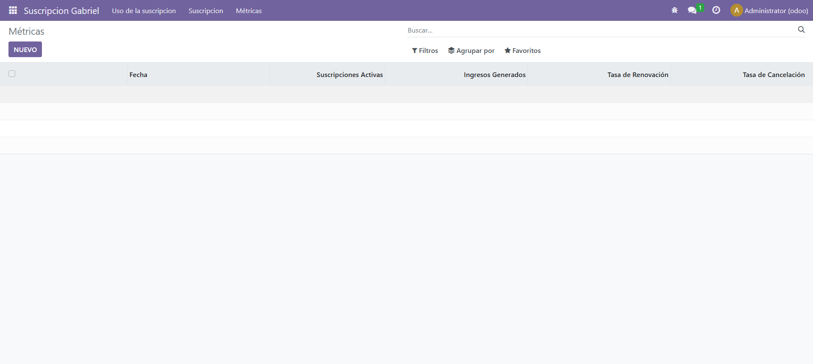
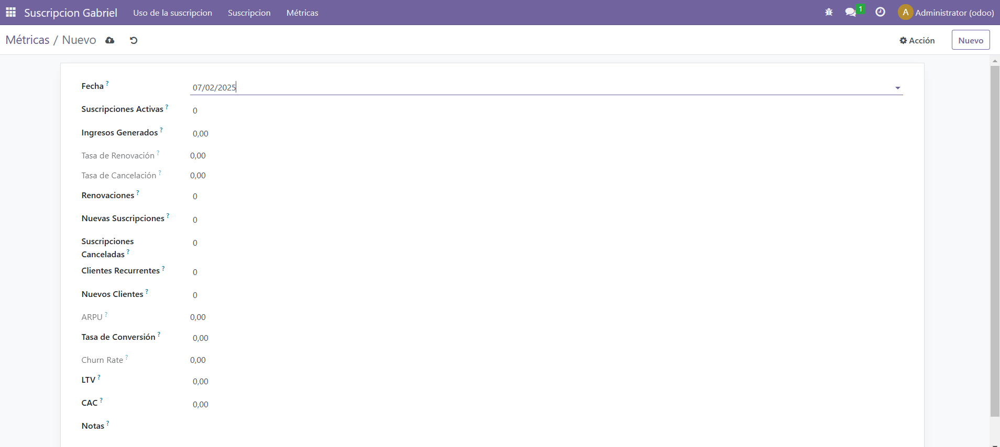

# Proyecto

## Creación del Modelo de Datos

### Definición del Modelo `subscription.metrics`

En primer lugar, definí un nuevo modelo llamado `subscription.metrics` para almacenar información sobre las suscripciones. Esta información incluye la cantidad de suscripciones activas, los ingresos generados, la tasa de renovación, cancelaciones y otras métricas clave.

### Creación de Campos

Agregué varios campos para almacenar los datos relevantes de cada métrica. Algunos campos son de tipo `Integer`, `Float`, `Date` y `Text`, dependiendo de la información que debía almacenar.

### Cálculo de Métricas

Para obtener valores derivados, implementé funciones computadas que recalculan tasas de renovación, cancelación y ARPU.

## Creación de Vistas en Odoo

### Vista de Lista (Tree View)

Para visualizar las métricas en un listado, definí una vista tipo `tree`.

### Vista de Formulario (Form View)

Para ver y editar registros individualmente, agregué una vista tipo `form`.

### Configuración de Permisos

Para gestionar permisos de usuario, creé un archivo `security/ir.model.access.csv` con permisos para acceder al modelo.

# ASÍ SE VE EL EJERCICIO

