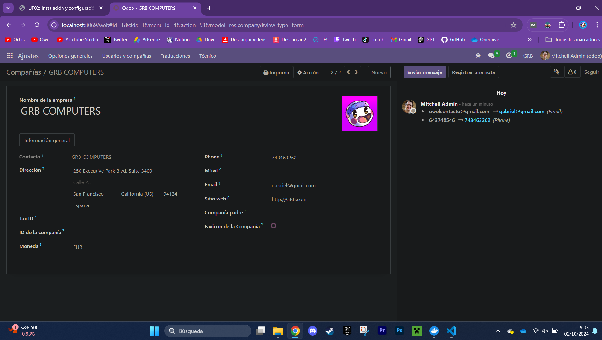
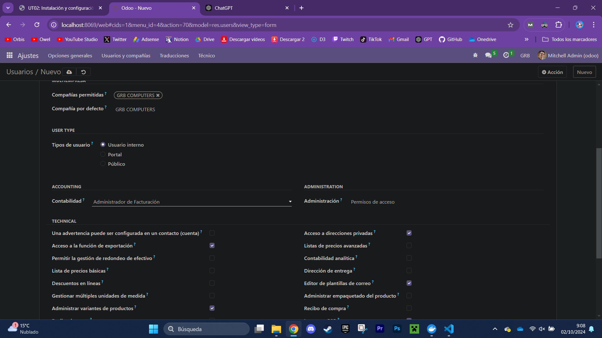
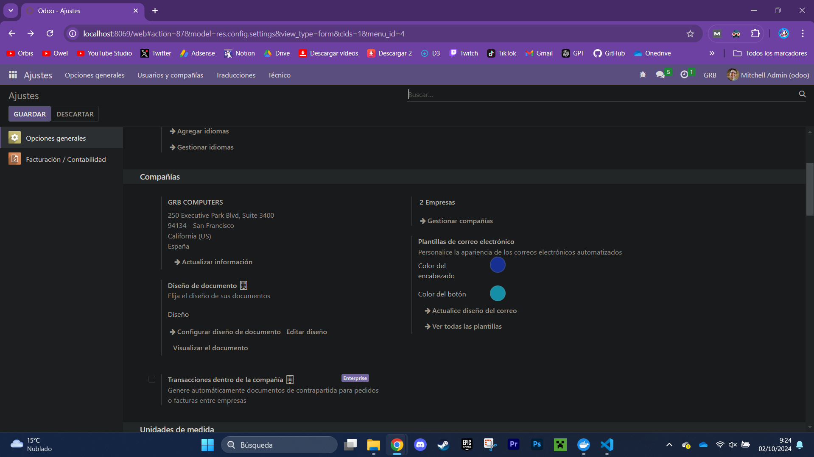
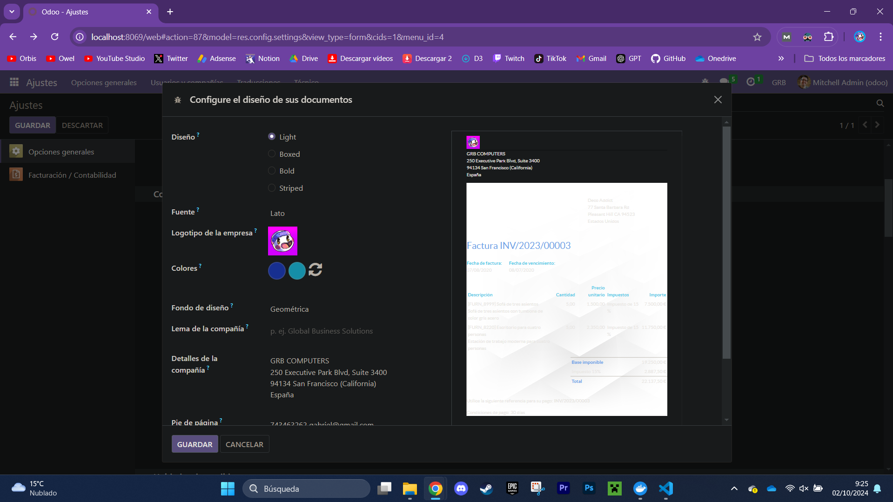
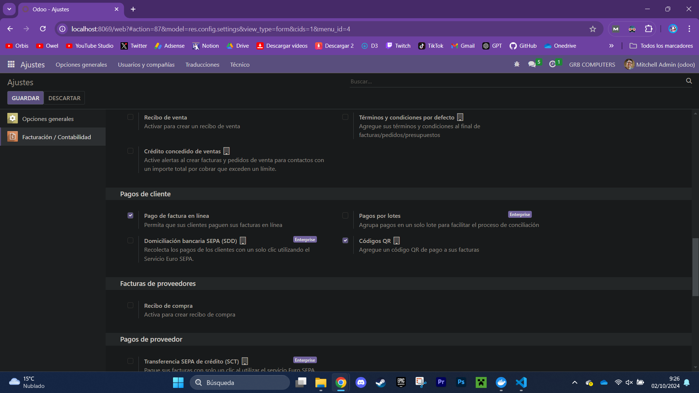
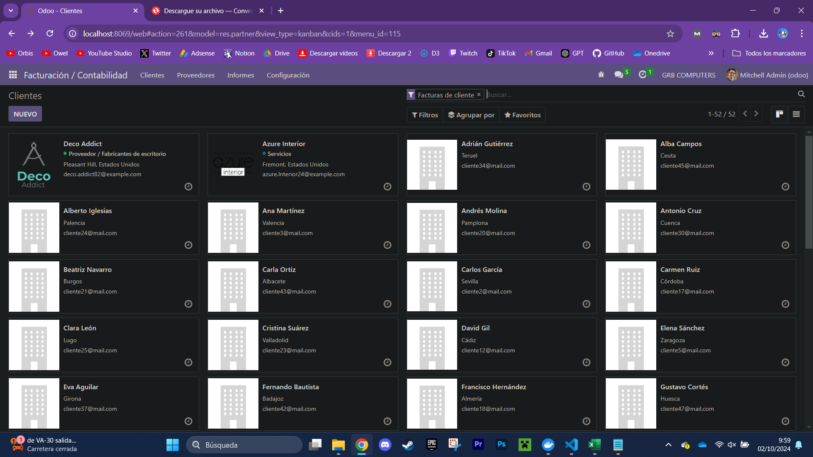
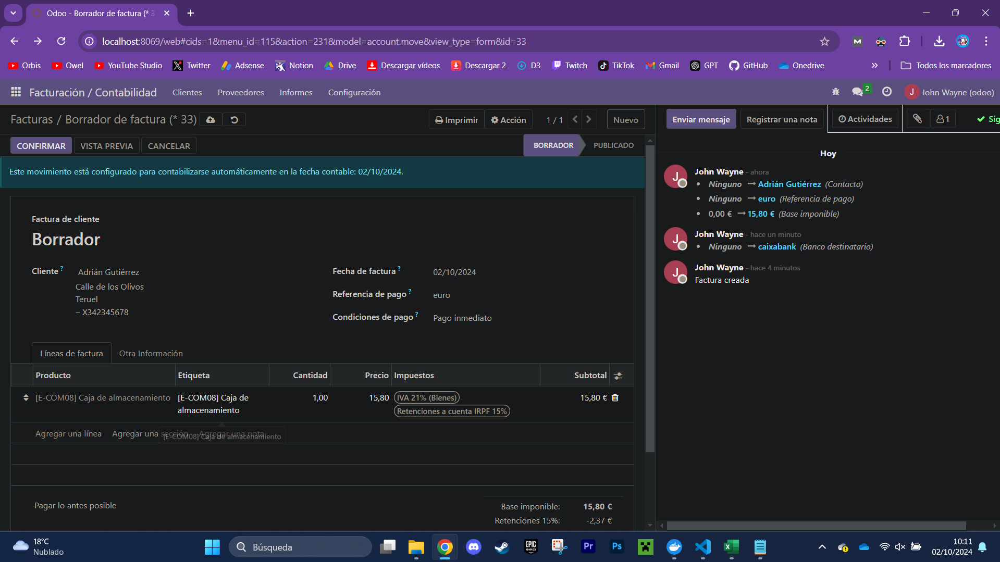
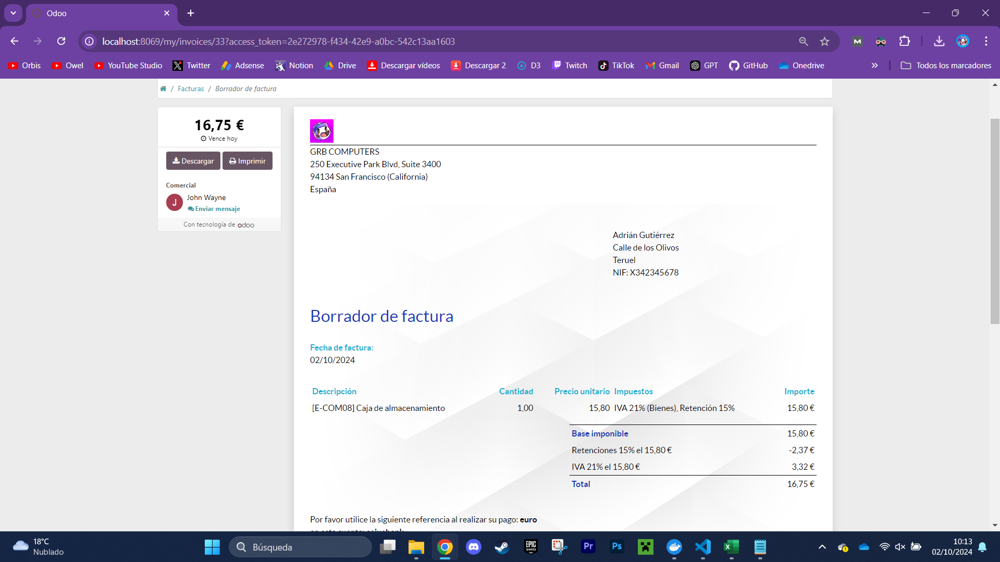

### PASOS QUE HE REALIZADO PARA HACER LA PRÁCTICA

1. Voy a ajustes en odoo y en usuarios y compañías elijo "compañías", 
2. Proseguidamente escribo todos los datos de mi empresa y le doy a "nuevo"

3. Creo un nuevo usuario y a este le asigno los permisos de facturación y los permisos de acceso

4. En opciones generales fui a "compañías" y cambié el color de los botones 

5. Proseguidamente le di a "configurar el diseño de sus documentos" y cambié el fondo de diseño a "geométrico" 
6. Finalmente, en "facturación" y en pagos de cliente, activé la posibilidad de usar códigos QR para pagar.

7. Ahora en clientes, añado el csv llamado "clientes.csv", una vez hecho, relleno los datos y le doy a "importar". Ya tenemos los clientes añadidos 
8. Inicio sesión como el usuario "John Wayne"
9. Ahora voy a facturas y creo una con todos los datos
10. Ya tengo la factura hecha.

 [FACTURA](./factura.pdf)