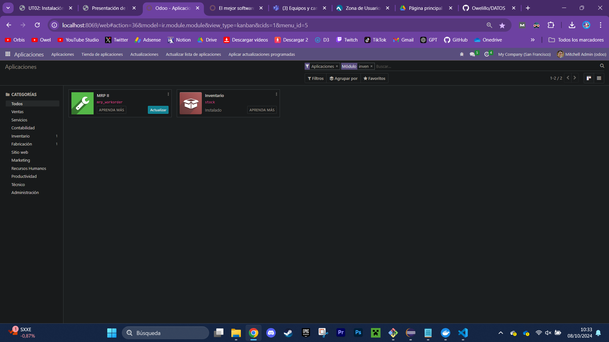
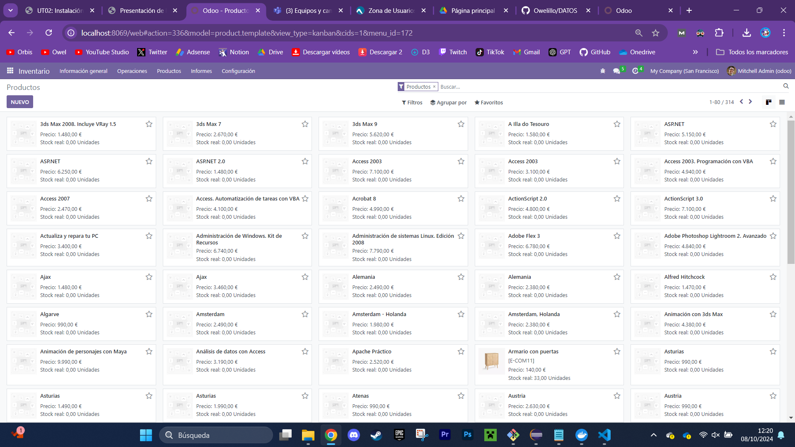
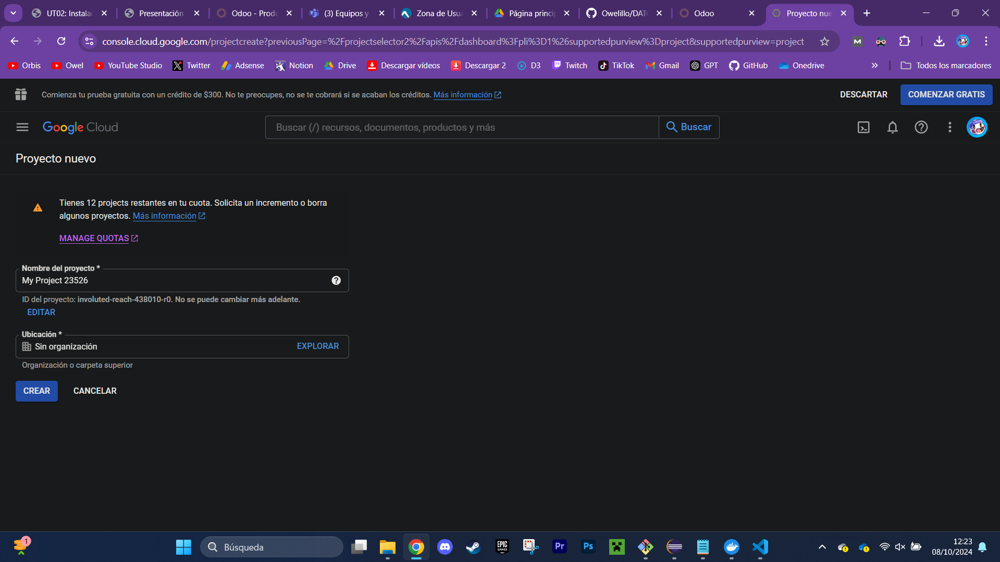
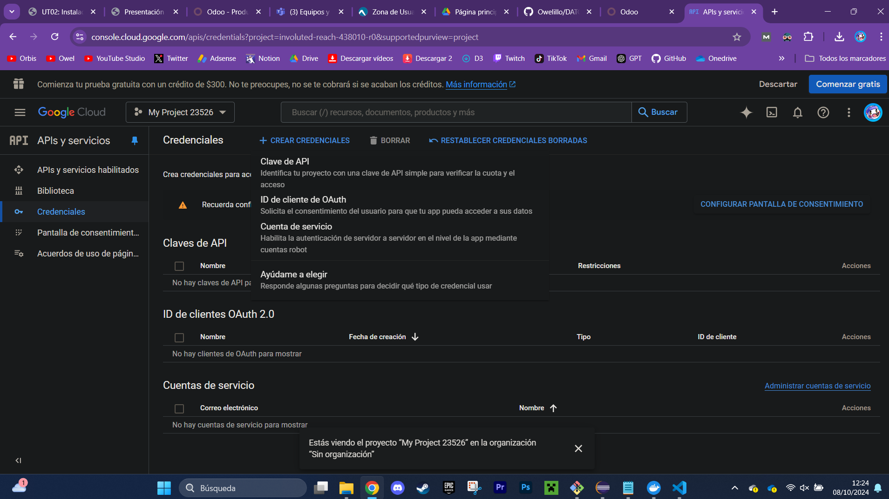
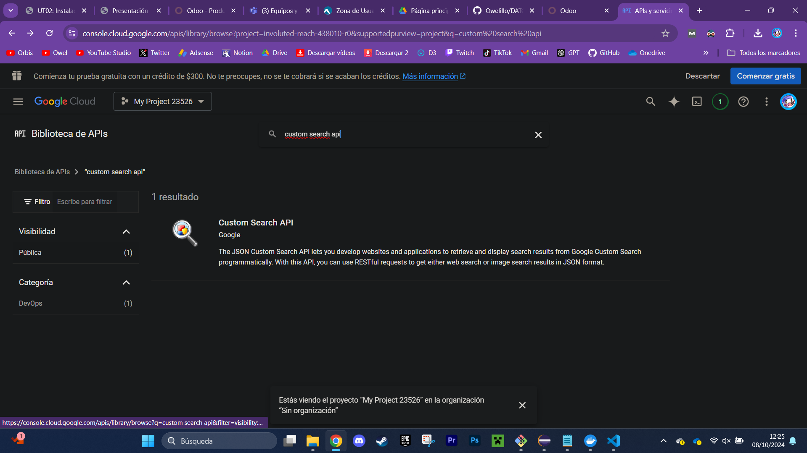
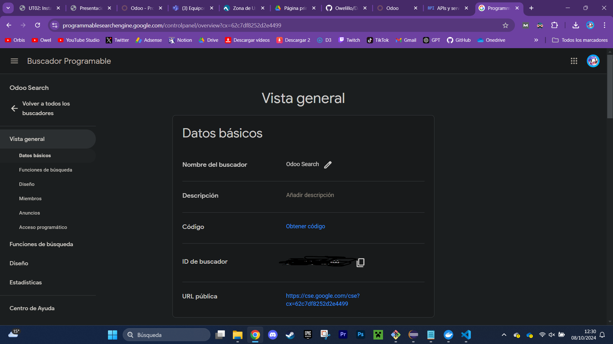
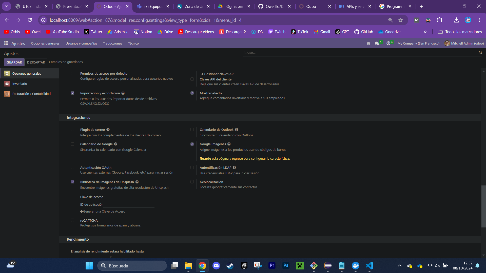
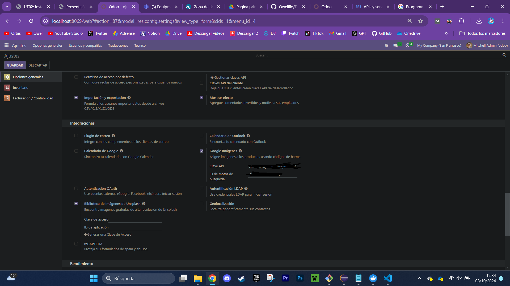
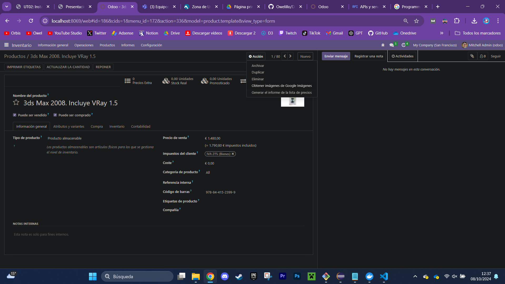

# PASOS REALIZADOS

1. Añado el módulo "inventario" 

2. Añado todos los productos 

3. Creo un proyecto en Google Clouds 

4. Creo una clave para mi API

5. Busco en biblioteca "Custom search api"

6. Creo un buscador de Google

7. Activo el buscador de google en odoo

8. Coloco las claves para usar las APIs

9. Utilizo la API para poner imágenes a mis productos
