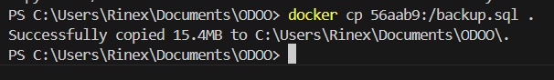
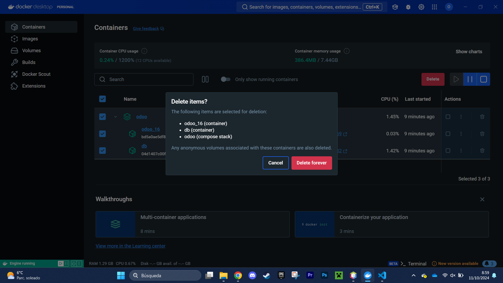
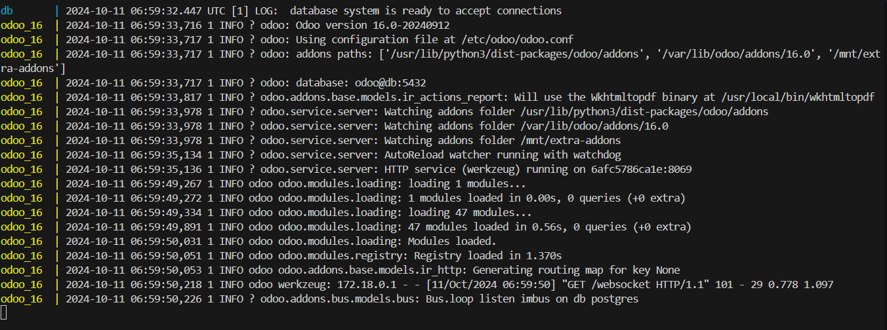
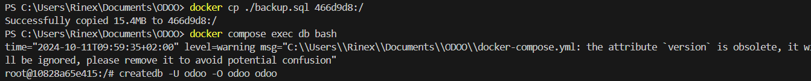
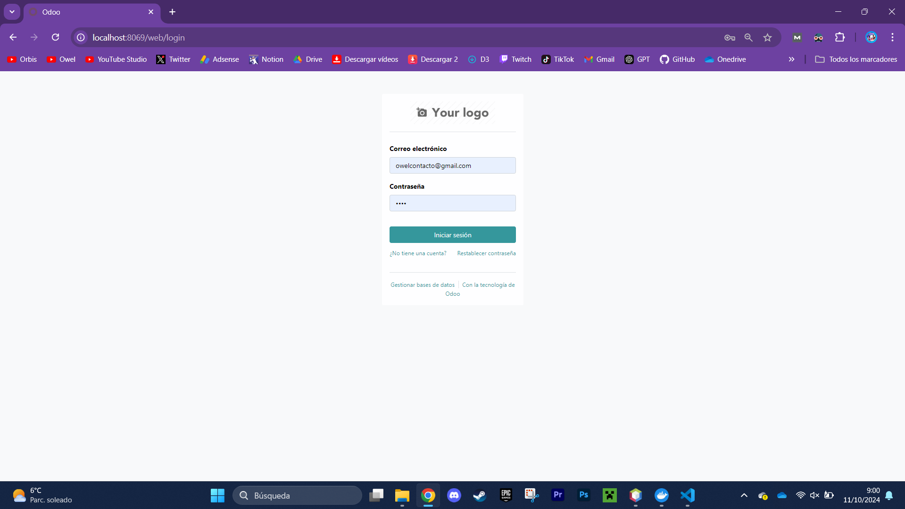
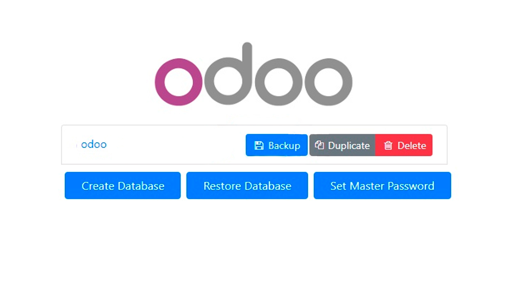

# PARTE 1: CREACUIB DE LA COPIA DE SEGURIDAD CON PG_DUMP

1. Con el comando cd me coloco en la carpeta que tiene el .yml
2. Después ejecuto docker con "docker compose exec db bash" para ejecutar la base de datos en el bash
3. Utilizo pg_dump para crear la copia de seguridad, -U es para que detecte el usuario de odoo y lo vuelco todo en backup.sql
4. Ahora lo saco del contenedor, hago exit para volver a la ruta y copio con docker cp 56aab9:/backup.sql . 
5. Borro todos los contenedores para hacer la copia de seguridad
8. Abro de nuevo con docker compose up
9. Copio la informacion del backup y lo pego en mi base de datos 
9. Ejecuto de nuevo con docker compose exec db bash
10. finalmente hago createdb -U odoo -O odoo odoo para crear la base de datos con la información de la copia de seguridad.

# PARTE 2: CREAR LA COPIA DE SEGURIDAD POR INTERFAZ
1. Esta forma es sencilla. Simplemente tengo que ir a la página del packup
2. Descargo en backup y le doy a "restore database"
