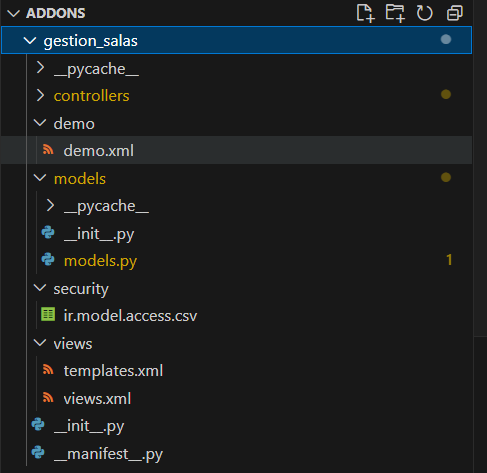
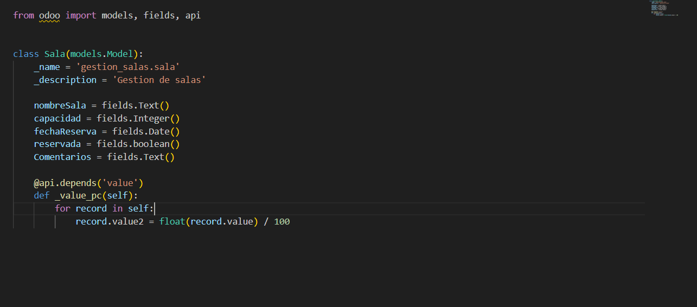
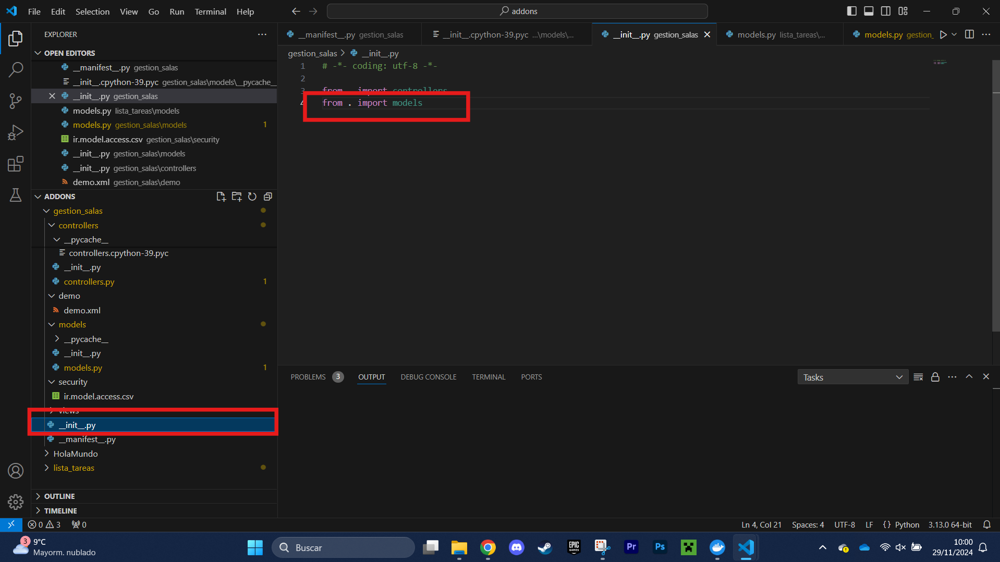
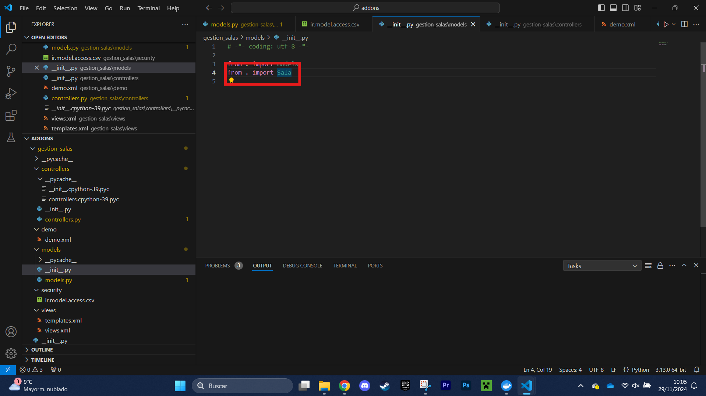
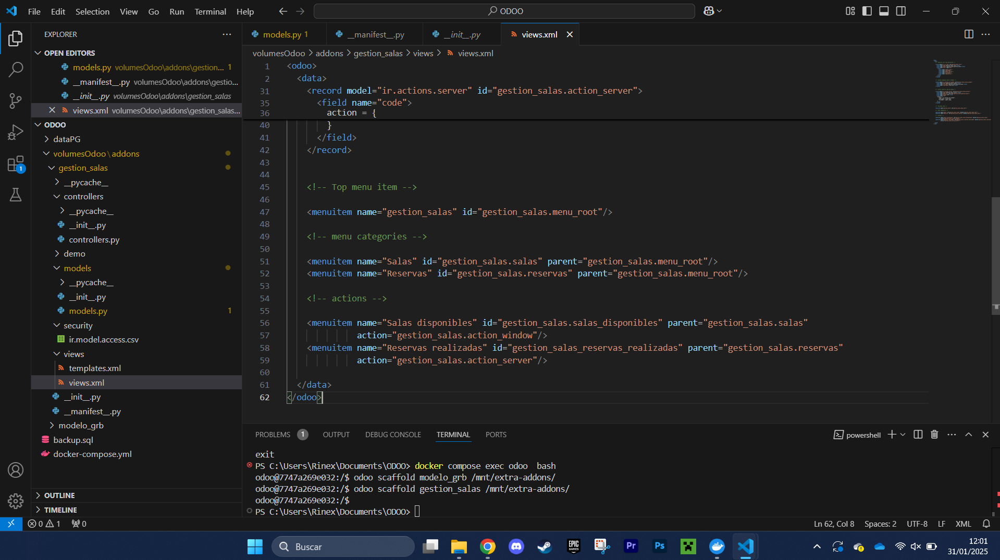
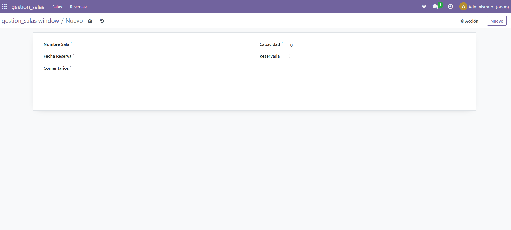

# CREACIÓN DE EL PRIMER MÓDULO EN ODOO

Para hacer el primer módulo hay que crear una estructura. Para ello hay que poner el comando 

    docker compose exec odoo bash 

y proseguidamente escribir: 

    odoo scaffold {nombre_del_modulo} /mnt/extra_addons/

Ahora que está la estructura, hay que empezar a programar

# PROGRAMACIÓN DEL MÓDULO
1) Lo primero es modificar el archivo models.py. Añadiendo los campos que se usarán en el módulo.

2) Después en el init principal se importa el modelo recientemente creado

3) En el init de models se importa la clase creada en el paso 1

4) Para hacer los menús, hay que tocar el views.xml

- Para ello he jugado con los menuitems y los submenús para hacer la estructura que se pedía

5) Finalmente, el módulo está completado y se puede usar.

