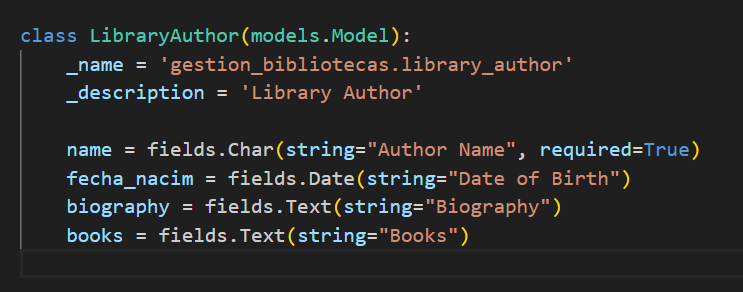
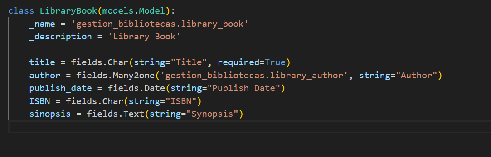
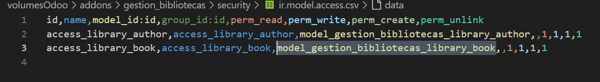
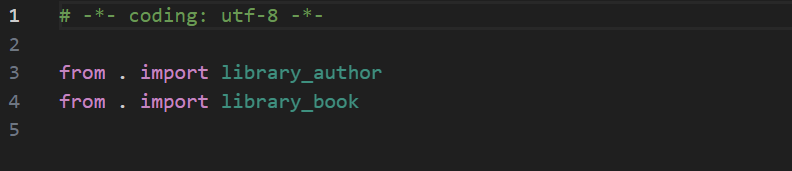
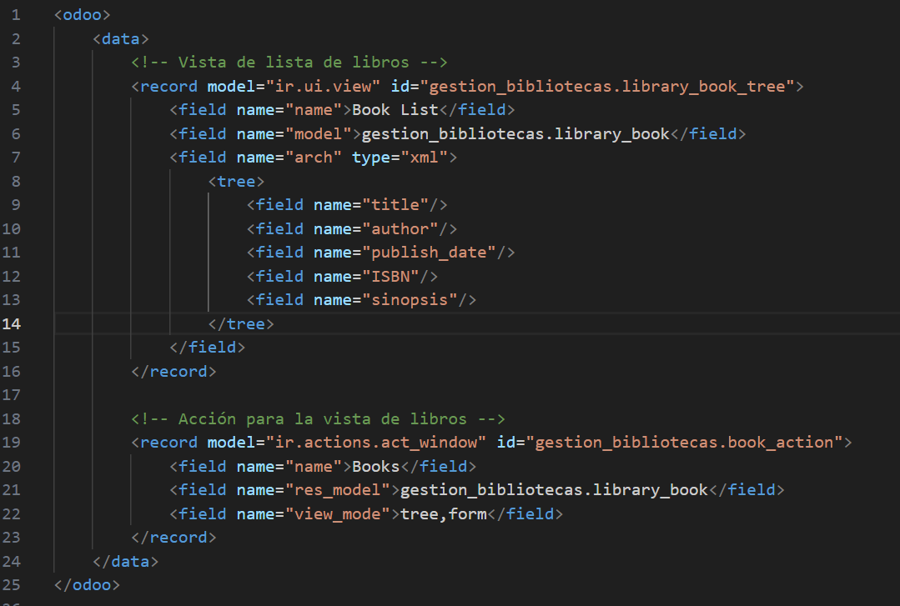
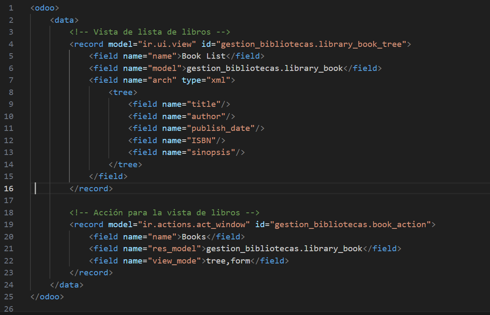
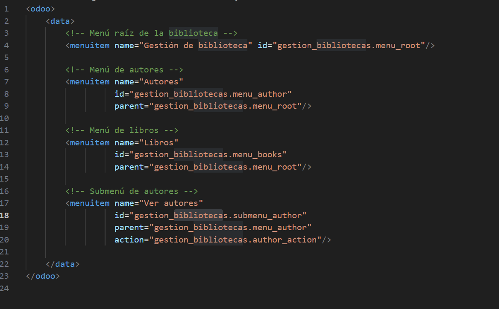
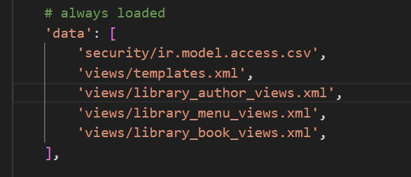
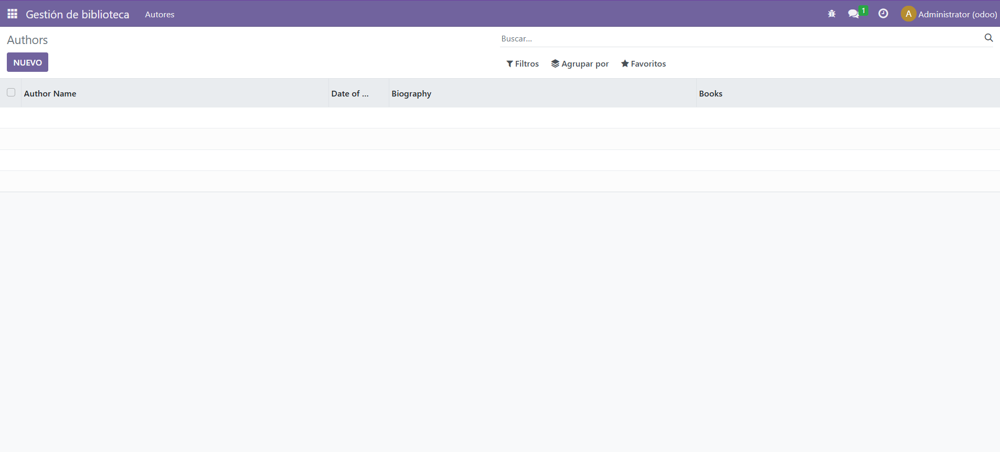

# MÓDULO CON DOS MODELOS

1) Para hacer este módulo, la única diferencia es que hay varios modelos, por lo que hay que definirlos y añadirlos en el security y el init.py

- Creación del modelo del autor
- Creación del modelo del libro 
- Adición de los modelos nuevos al security
. Importación de los modelos al init.py 

2) Ahora que ya están hechos los modelos, hay que hacer las vistas. Para ello hacemos una vista para cada uno de los modelos

- Creo un view para el autor 
- Creo otra view para los libros 
- Y finalmente creo otra para los menús de ambas views 
- Además hay que asegurarse de que en el manifest están todas las vistas añadidas correctamente

3) Confirmamos que se vea todo correctamente en odoo