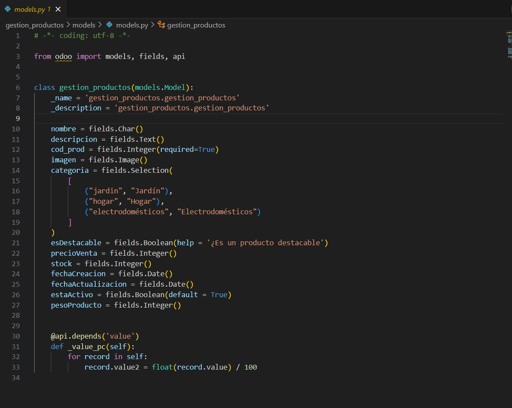
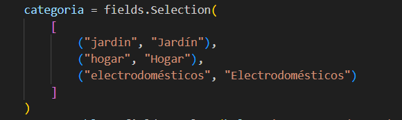
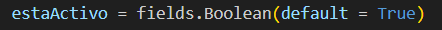
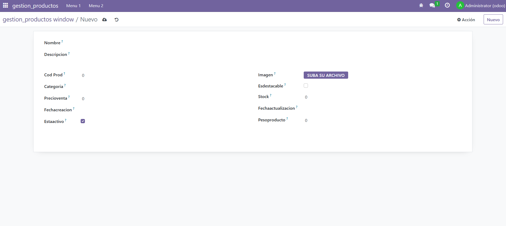

# CAMPOS DEL MODELO

Para hacer los campos de un modelo es muy simple. Solamente hay que escribir el nombre y proseguidamente fields.[tipo de dato] en el archivo **models.py**

Hay muchos tipos de datos, pero los más complejos son:

1) **selection:** para usar este tipo de dato, hay que usar la siguiente sintaxis:

2) **Boolean:** se puede colocar un valor por defecto con "default = {true/false}"

## OTROS DETALLES IMPORTANTES

He usado distintos parámetros dentro de los paréntesis para indicar distintas cosas. He aquí algunos de estos parámetros explicados:

1) **required:** indica si este campo es obligatorio (true) o no lo es (false)
2) **help:** el texto que se coloca entre comillas aparecerá cuando el usuario pasa su raton encima de la "?" del campo

Esto es todo lo que he usado para este ejercicio, pero hay muchos más.

## **Así se debería de ver el módulo**
