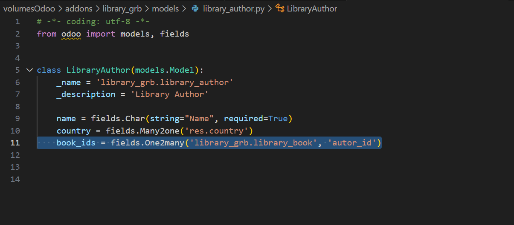
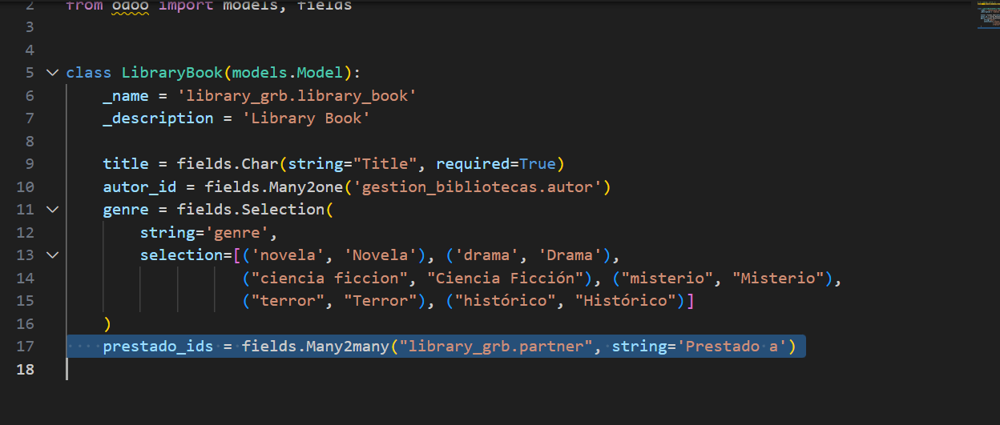
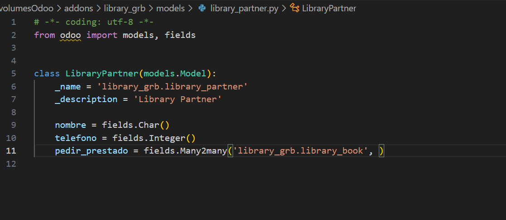
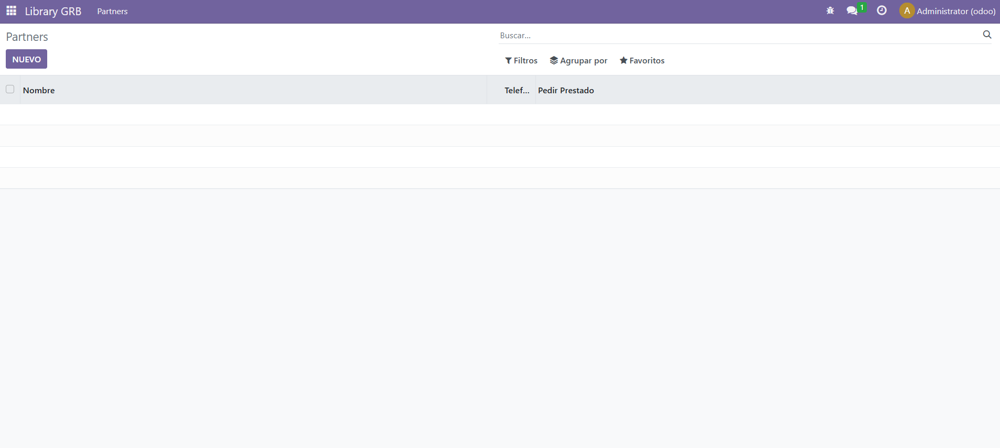

# CAMPOS RELACIONALES DEL MODELO

1) Para crear campos relacionales solamente hay que indicar qué tipo de relación tiene. Estas relaciones pueden ser:

- Many2one (muchos a uno)
- One2many (uno a muchos)
- Many2many (muchos a muchos)

2) En este ejercicio, en los autores por ejemplo, usé un One2many para los libros que tiene el autor, porque un autor puede tener muchos libros 

3) Luego, en el modelo de los libros, hice un Many2many, porque muchos libros pueden ser prestados a muchos socios

4) Por último, en los libros, también hice una relación Many2many por la misma razón 

Por último, solamente queda añadir los modelos al init, al security y hacer los menús y las views, y añadirlas al manifest.

## Así queda el ejercicio. 

### Evidentemente, por las condiciones que hemos puesto, un autor puede tener varios libros, pero un libro no puede tener varios autores, y así sucesivamente.

 