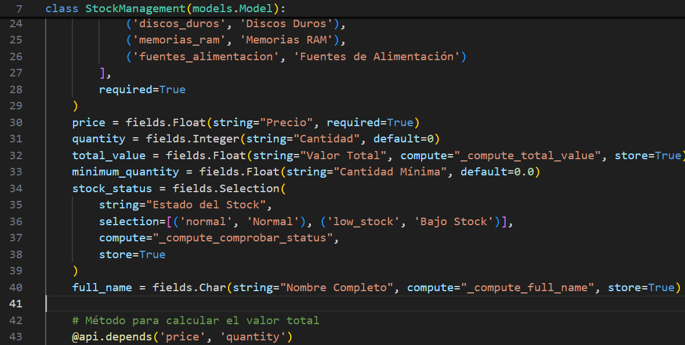
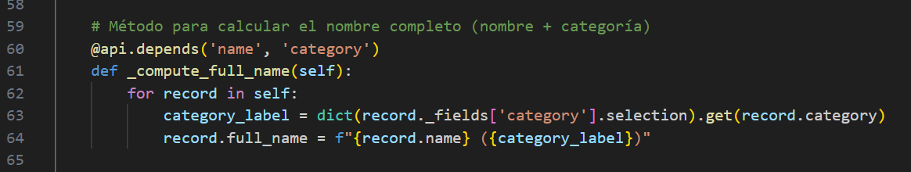
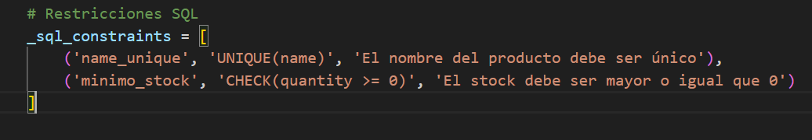
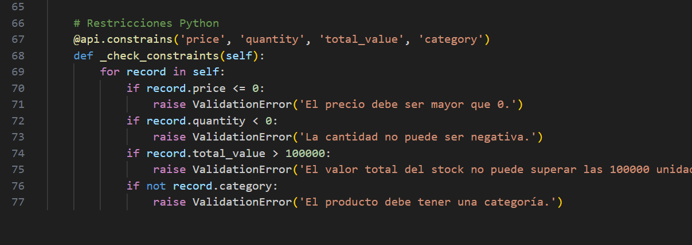
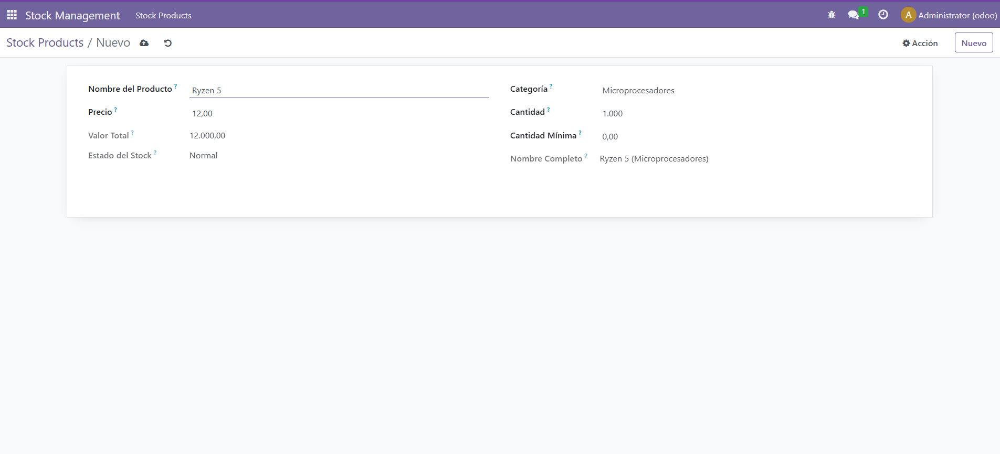

# CAMPOS CALCULADOS Y RESTRICCIONES

Este ejercicio pide que se hagan campos calculados y restricciones. Así que voy a explicar cómo hice primero los calculados.

## CAMPOS CALCULADOS

- Para estos campos, simplemente hay que poner la etiqueta "Compute" y escribir el nombre de la funcion que vamos a crear

- Esta función se crea más abajo, y simplemente hay que escribir un código python

- Una vez el campo llame a esta función, se ejecutará y returnará lo que se programe

## RESTRICCIONES

### **RESTRICCIONES SQL**

1) Estas restricciones sirven se crean arriba del todo del modelo.
- Estas restricciones son sencillas. En el primer string se debe de introducir el nombre de la restriccion, en el segundo la condición o lo que hace esta restriccion, y en el último lo que devuelve la restricción.

- Entonces, cada vez que se cumpla la condición, saltará un error

## **RESTRICCIONES PYTHON**

1) Para estas restricciones hay que poner el decorador "@api.constrains" seguido de los datos que quieres que cuando se modifiquen o cambien, salte esta restricción

- Finalmente se crean las condiciones para esta restricción

# Así queda el módulo: 
