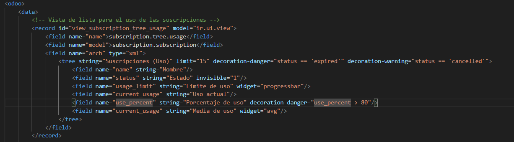

# VISTA DE TIPO VISTA

Para hacer esta práctica, lo primero que hay que hacer es crear el modelo. Este va a tener muchos campos diferentes, y voy a explicar cada uno de ellos.

- El nombre: simplemente es obligatorio
- El id del usuario: este utiliza un Mny2one
- El código de la suscripción: es obligatorio
- La fecha de inicio: es obligatoria
- La decha de inicio: no es obligatoria
- La duración en meses: utiliza un campo calculado para calcular los meses
- La fecha de renovación: no tiene nada especial
- El estado: simplemente un campo con selection
- Es renovable: un simple booleano 

- Auto-renovar: es un campo calculado que renueva automáticamente si es true

# Funciones creadas

- La primera función la uso papra renovar automáticamente si el campo es true
- Y la segunda función la usaré en la vista para el botón de añadir 15 días

- Las otras dos simplemente calculan el porcentaje y la duración en meses

# Restricciones SQL

- Puse restricciones para que los campos necesarios sean únicos

# VISTAS

### PRIMERA VISTA: LA BÁSICA

La vista básica tiene:

- Un límite de 15 inserciones, y hay dos decoraciones:
1) si status es igual a expired, se coloca el "danger"
2) si el status es cancelled, se coloca el "cancelled"
- End date: tiene un widget que te dice cuántos días le quedan
- Precio: si el estado es igual a cancelled, se queda invisible
- Un botón: llama a la función de añadir 15 días de antes, 

## SEGUNDA VISTA: USO DE SUSCRIPCIONES

Esta vista tiene: 

- Un límite de 15
- Si el estado es expirado, sale el color "danger"
- Si el estado es cancelado, sale el color warning
- El estado es invisible
- El límite de uso es una progressbar
- El porcentaje de uso si es mayor de 80, se pone el color warning
- Y el uso actual escribe la media de uso

Finalmente, hay que hacer los menús y añadir todo al manifest, y ya funciona el modelo.

### IMPORTANTE:

- Para hacer que dos vistas usen distintos campos de un mismo modelo, hay que especificárselo en la acción de la vista

