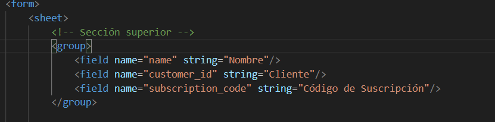
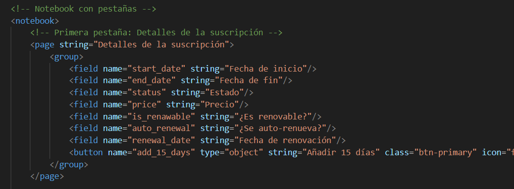
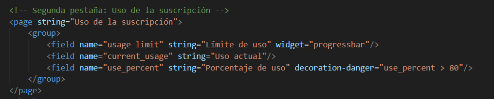
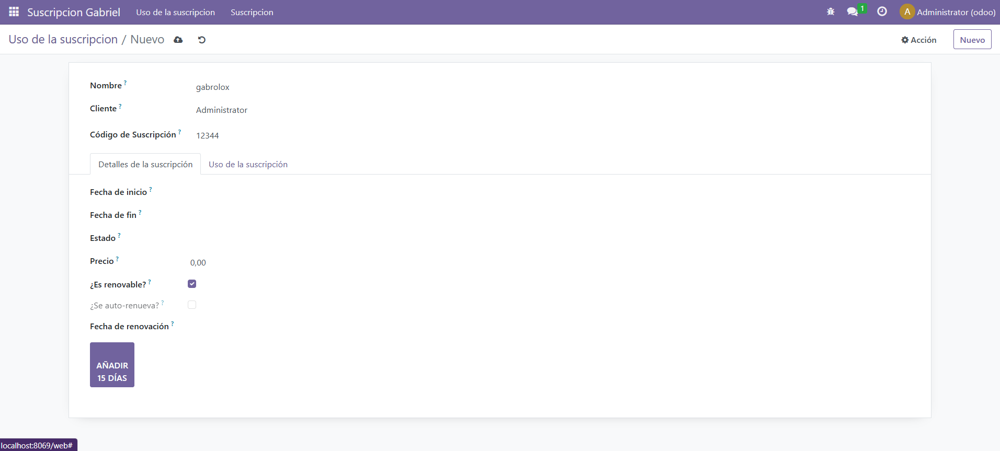

# VISTAS DE TIPO FORMULARIO

- Para hacer una vista de tipo formulario hay que crear otro xml en el que se añadan todos los campos que se quieren usar.

- Para ello se usa la etiqueta 'group' para agrupar distintos campos. En este caso lo uso para el nombre, el id y el codigo de la suscripción

- Otra etiqueta es 'notebook', que sirve para poner distintas páginas dentro de un pequeño menú en el formulario

 

 - Además de 'notebook', se debe usar la etiqueta 'page' para definir las páginas que va a tener el notebook. Esta página puede tener grupos y distintos campos

- Si se quieren añadir más páginas, hay que hacerlo dentro de la etiqueta 'notebook' y siguiendo los pasos que comenté antes
 

 Con esos pasos, cuando se vaya a añadir una entrada en nuestras vistas, se abrirá esta vista nueva con todos los campos y páginas creadas

 