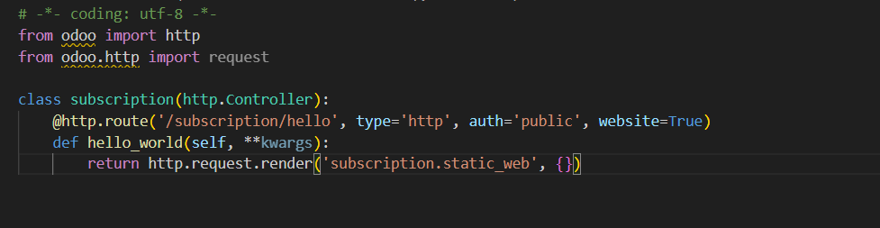
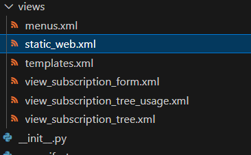
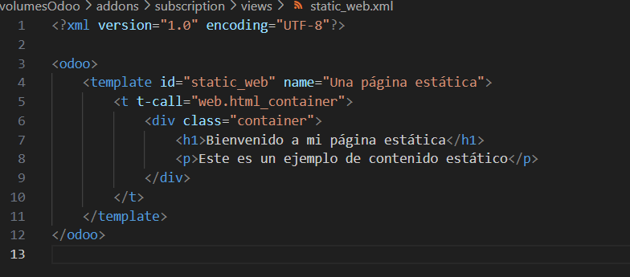
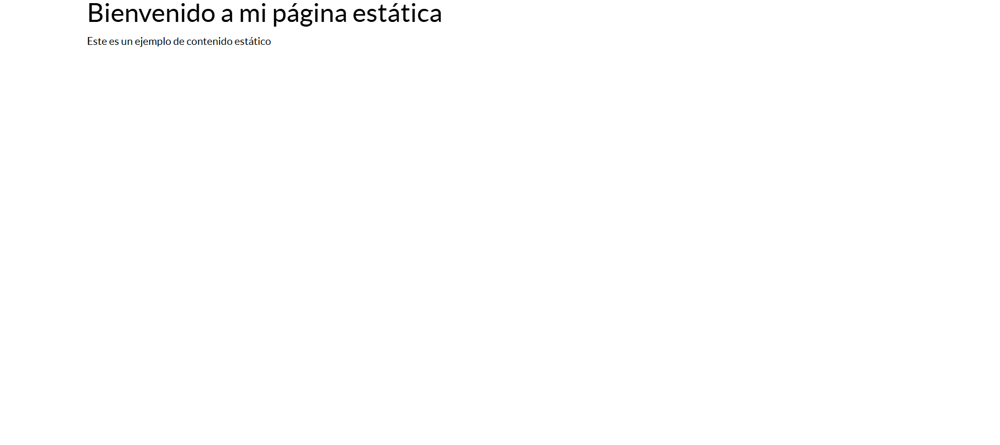
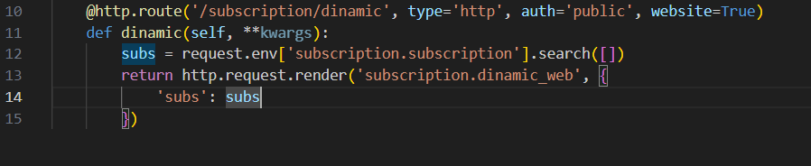
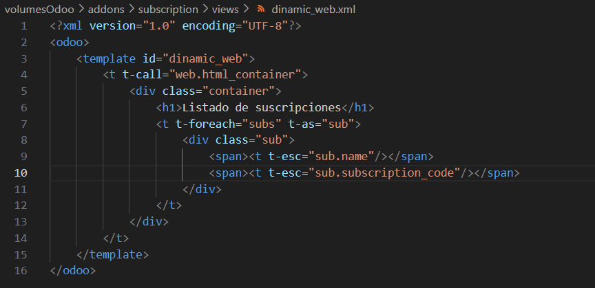
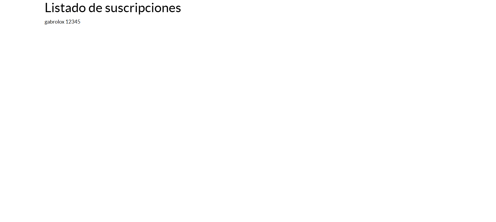

# PÁGINA ESTÁTICA Y DINÁMICA BÁSICA

## PÁGINA ESTÁTICA:

- Para hacer la página estática hay que ir a la carpeta 'controllers'.
- Una vez allí, para crear una página estática con un html propio, hay que returnar con 'http.request.render' y después del nombre del xml que vamos a crear

- Este xml tendrá todo el contenido de la página estática y se tiene que crear dentro de 'views'

- Es importante que la id que se coloque aquí sea la misma que la del controller.

- Por lo demás, son etiquetas que hemos dado en clase y un código html sencillo

## IMPORTANTE:

Para ver la página, primero hay que actualizar el módulo. He estado mucho rato para ver cuál era el error, y simplemente no había actualizado el módulo

- Luego, ya podrás ver, accediendo al link que se coloca en la clase 'controllers', la página estática

## PAGINA DINÁMICA

- Para crear la página dinámica hay que seguir unos pasos parecidos a la estática.
- Primero hay que hacer una variable que obtenga todos los campos del modelo
- Luego se guarda

- Luego, en el xml de la página dinámica, se busca de entre todos los campos del modelo, el nombre y el código de la suscripción

Con esto, y cambiando el manifest, la página ya iría cambiando dependiendo de los usuarios que hayan puesto sus suscripciones
